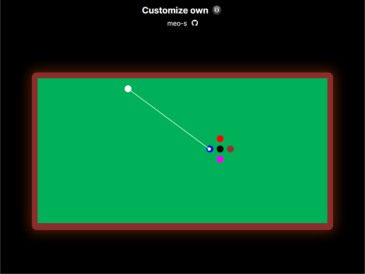

# 당구 시뮬레이터

아주 단순한 당구 시뮬레이터입니다. :blush:

<div style="display: flex; justify-content: center; width: 100%;">
    </img>
</div>
<br />

## 간단한 설명

### `CuesportsSimulator`

당구공들의 움직임을 흉내내는 클래스입니다.

`CuesportsSimulator`는 1초에 60번 상태의 갱신 `update()`과 렌더링 `render()` 작업을 수행합니다. 이때, 물리 운동의 갱신 간격이 되는 `constants.dt`는 `1/120s`로 설정되어 있으며, 이는 시뮬레이터에서의 1초는 현실의 2초가 됨을 의미합니다.  

시뮬레이터의 갱신과 렌더링 작업에 개입하고 싶다면, `cuesports-simulator-core.js` 파일을 직접 수정하거나 `CuesportsSimulator`가 노출하는 메서드를 사용하여 시뮬레이터 클래스 외부에서도 비교적 간단하게 시뮬레이터와 상호작용 할 수 있습니다.  

#### CuesportsSimulator()

```js
class CuesportsSimulator {
    constructor(canvas, renderScale) {
        /** @type {Ball[]} */
        this.balls = []
        /** @type {SimpleRenderer} */
        this.renderer = new SimpleRenderer(canvas, renderScale || constants.rs);
        /** @type {Array<(dt: number, balls: Ball[]) => void>} */
        this.updateHooks = [this._updateBalls.bind(this)];
        /** @type {Array<(renderer: SimpleRenderer, balls: Ball[]) => void>} */
        this.renderHooks = [this._renderBackground.bind(this), this._renderBalls.bind(this)];
    }

    ...
}
```

-   `CuesportsSimulator.balls`  
    시뮬레이터에가 관리하는 당구공(`Ball`) 객체를 저장하는 배열입니다.  
    이 배열에 `Ball` 객체를 직접 추가하거나, `CuesportsSimulator.addBall()` 메서드를 사용하여 원하는 만큼 시뮬레이터에 당구공을 추가 할 수 있습니다.

-   `CuesportsSimulator.renderer`  
    시뮬레이터의 상태를 그리기 위해 사용되는 아주 간단한 클래스의 인스턴스를 저장합니다.

-   `CuesportsSimulator.updateHooks`  
    시뮬레이터가 상태를 갱신할 때, 추가적으로 호출될 콜백 함수들을 저장하는 배열입니다. 이 배열을 직접 수정하거나, `CuesportsSimulator.registerUpdateHook()` 메서드를 호출하여 당구공의 갱신 단계에 호출될 콜백 함수들을 추가 할 수 있습니다.

-   `CuesportsSimulator.renderHooks`  
    시뮬레이터가 웹 페이지에 상태를 그릴 때, 추가적으로 호출될 콜백 함수들을 저장하는 배열입니다. 이 배열을 직접 수정하거나, `CuesportsSimulator.registerUpdateHook()` 메서드를 호출하여 렌더링 단계에 호출될 콜백 함수들을 추가 할 수 있습니다.

#### `CuesportsSimulator.registerUpdateHook()`

``` js
/**
 * @param {Ball[]} balls
 */
function myUpdateHook(balls) {
    ...
}

const simulator = new CuesportsSimulator(...);
simulator.registerUpdateHook(myUpdateHook);
```

#### `CuesportsSimulator.registerRenderHook()`

``` js
/**
 * @param {SimpleRenderer} renderer
 * @param {Ball[]} balls
 */
function myRenderHook(renderer, balls) {
    ...
}

const simulator = new CuesportsSimulator(...);
simulator.registerRenderHook(myRenderHook);
```

#### `CuesportsSimulator.addBall()`

``` js
const simulator = new CuesportsSimulator(...);
...

const additionalBall = new Ball(unit.cm(100), unit.cm(100), new RGB(255, 255, 0));
simulator.addBall(additionalBall);
```

## 참고 문헌

[Moving Balls, brownsoo.github.io](https://brownsoo.github.io/2DVectors/moving_balls/)  
